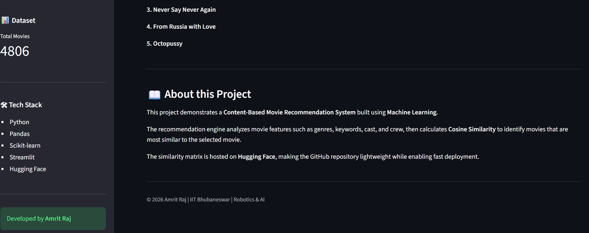
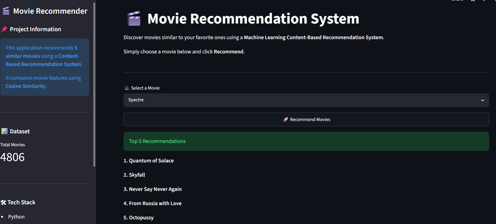

# 🎬 Movie Recommendation System

A **Content-Based Movie Recommendation System** built using **Machine Learning** and deployed with **Streamlit**. The application recommends **5 similar movies** based on the movie selected by the user by computing **Cosine Similarity** between movie feature vectors.

🔗 **Live Demo:** https://movie-recommender-system-basic.streamlit.app/

---

## 📌 Project Overview

This project recommends movies that are similar to a selected movie using a **Content-Based Filtering** approach.

Instead of relying on user ratings, the recommendation engine analyzes movie metadata such as:

- Genres
- Keywords
- Cast
- Crew
- Overview

These features are combined into a single text representation, vectorized using **CountVectorizer**, and compared using **Cosine Similarity** to identify the most similar movies.

---

## ✨ Features

- 🎥 Recommend 5 similar movies instantly
- 🔍 Search from over **4,800 movies**
- 🤖 Content-Based Recommendation Engine
- ⚡ Fast recommendations using a precomputed similarity matrix
- 🌐 Interactive web application built with Streamlit
- ☁️ Large similarity model hosted on Hugging Face to keep the GitHub repository lightweight

---

## 🛠️ Tech Stack

| Category | Technology |
|----------|------------|
| Language | Python |
| Data Processing | Pandas, NumPy |
| Machine Learning | Scikit-learn |
| Recommendation Algorithm | Content-Based Filtering |
| Vectorization | CountVectorizer |
| Similarity Metric | Cosine Similarity |
| Model Storage | Pickle |
| Model Hosting | Hugging Face |
| Web Framework | Streamlit |

---

## 📂 Project Structure

```text
movie-recommender-system/
│
├── app.py
├── movies_dict.pkl
├── requirements.txt
├── README.md
├── .gitignore
└── Movie Recommender System.ipynb
```

---

## ⚙️ How It Works

1. Load the processed movie dataset.
2. Convert movie metadata into feature vectors.
3. Compute the cosine similarity matrix.
4. Store the similarity matrix as a pickle file.
5. Host the similarity matrix on Hugging Face.
6. Download the similarity matrix automatically when the application starts.
7. Recommend the top 5 most similar movies.

---

## 🚀 Installation

### Clone the repository

```bash
git clone https://github.com/YOUR_USERNAME/movie-recommender-system.git
```

```bash
cd movie-recommender-system
```

### Create Virtual Environment (Optional)

```bash
python -m venv venv
```

### Activate Environment

**Windows**

```bash
venv\Scripts\activate
```

**Linux / macOS**

```bash
source venv/bin/activate
```

### Install Dependencies

```bash
pip install -r requirements.txt
```

### Run the Application

```bash
streamlit run app.py
```

---

## 📊 Dataset

This project uses the **TMDB 5000 Movie Dataset**.

The dataset contains information such as:

- Movie Title
- Genres
- Keywords
- Cast
- Crew
- Overview

The raw dataset is **not included** in this repository to keep it lightweight.

---

## 🤗 Model Hosting

The similarity matrix (`similarity.pkl`) is hosted on **Hugging Face** instead of GitHub because of its size.

The application automatically downloads the file during startup.

---

## 📷 Application Preview

| Home Page | Recommendation Result |
|-----------|-----------------------|
|  |  |

## 🎯 Future Improvements

- Display movie posters using the TMDB API
- Show movie ratings
- Display movie overview and genres
- Filter recommendations by genre
- Improve recommendation quality using TF-IDF
- Add hybrid recommendation techniques
- Deploy using Docker

---

## 📚 Machine Learning Workflow

```
Movie Dataset
        │
        ▼
Feature Engineering
        │
        ▼
CountVectorizer
        │
        ▼
Feature Matrix
        │
        ▼
Cosine Similarity
        │
        ▼
Top 5 Similar Movies
```

---

## 👨‍💻 Author

**Amrit Raj**

M.Tech in Robotics & AI  
Indian Institute of Technology (IIT) Bhubaneswar

---

## ⭐ Support

If you found this project useful, consider giving it a ⭐ on GitHub.
